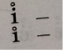

# 简谱快速记谱


## 动机

在录入简谱时，由于读简谱-打五线谱较为繁琐以及OCR技术的不成熟，因此需要一个方法来**快速**，而同时**简单**地录入简谱。因此，本方法提出用一种文本速记方式代替五线谱打谱软件来达到从图片（纸质书）简谱录入并转为电子版五线谱（MusicXML/MIDI）格式。

## 简介

基本思想：本方法基于Excel表格，将一行视为一个小节，而每一列则视为小节中的音符。通过在每个单元格内输入以制定规则排列的字符，就做到了简谱的录入。

## 工作流程

先将简谱录入为Excel文件，再使用python程序将Excel文件中的内容转换为MusicXML文件。

## 特性

- 上手简便，在录入时不用考虑、计算音高与时值。
- 录入快，熟练后大约可在3-5分钟录入一页古琴谱。
- 可以录入泛音记号。
- 可以直接自动生成MusicXML文件，在生成MusicXML文件时自动标记拍号，并做有限度的纠错。

## 速录格式

本速录的格式基于Excel表格与小键盘。在Excel表格中，Excel表格，将一行视为一个小节，而每一列则视为小节中的音符。每个单元格的内容，即音符的表示为文本格式，其中音符由代表音高、时值等的字符组成。各字符分别代表简谱中的元素，字符之间没有顺序要求（除多音外）。

具体录入规则如下：

- 输入Tab键（即下一个单元格）以输入下一个音。
- 输入Enter键（即下一行）以输入下一个小节。
- 输入空行（即两次Enter）以输入下一段。（即转换程序会把空行分割的小节转换为一个单独的段）
- 单个音：
  - 数字0-7代表简谱谱面的音高，空拍。
  - 数字8对应升一个八度（即简谱数字上的点），数字9对应降一个八度（即简谱数字下的点），其中升、降八度的数目为数8或9出现的个数。
  - “\*”代表升号（升一个半音），“/”代表降号（降一个半音）。
  - 下划线（八分音符、十六分音符等）用“-”表示，而短线（二分音符、全音符等）用+表示（即为时值比四分音符长）。
  - 符点用“.”（小数点）表示。
  - 泛音，为标记在数字上的空心圆，用“\`”表示（TAB键上方、“1键”左边的键）。
  - n连音：简谱中连音的书写规则大致为：时值为一个四分音符的连音，小于4连音时音符下一条线，4到8连音时音符下两条线，以此类推。我们将连音中的音视为一个个具有特殊时值的音符。因此，每个音占一个单元格。三连音、五连音、六连音可以在音符中分别加上“t”（triplet）、“q”（quintuplet）、“s”（sextuplet）以简便记录。任意连音（也包括三、五、六连音）可以在音符结尾添加“[n]”以表示n连音。比如，“1-t”也可以写成“1-[3]”
  - 单个音中字符的书写顺序**没有限制**。
- 双音/多音：
  - 多音的间隔符用“空格-Space”表示。即，上下排列的每个音符独立录入，使用空格分隔开。多音的时值需要一并录入到最后（最下）一个音符，以此表示这一个和弦的时值。前一个音的时值将会被舍弃。**请注意，若有泛音，请在每个音上分别标注。**如：推荐录入为“\`81 \`1-”，若录入为“\`81- \`1-”也可。

录入示例：


## MusicXML文件生成

Python的运行环境需要安装如下包：`pip install numpy pandas music21`。

转换程序：`xlsx2xml.py`

运行方式：

```
"将以xlsx格式储存的文字转录谱转换为MusicXML文件。"
"命令行格式：xlsx2xml.py <input_dir> <output_dir> [no-split] [debug]"
"input_dir: .xlsx 文件储存路径, output_dir: .musicxml 文件输出路径。"
"如果不需要在转换时按段切割谱子，则在最后加上--no-split参数"
"命令行示例：xlsx2xml.py Dataset/input Dataset/output"
"加入--debug参数可以有限度地自动检查录入错误与不完整小节。"
```

需要注意的是：输出谱子的保存路径会带有输入谱子的上一级文件夹，即，输入文件夹为`谱子/古琴谱/a.xlsx`，输出为：`输出路径/古琴谱/a.xlsx`。

错误提示：

程序在转换的同时会输出录入可能存在的错误。可以提示的错误类型如下：

- 不完整小节Incomplete Measure: 即当前小节不为整数拍。
- 多个音高Multiple Pitch：一个音符内录入了多个音高（排除多音）。
- 无音高或有多个相同音高No Pitch or Multiple Same Pitch：一个音符内没有录入音高或者录入了多个相同音高。

泛音的转换：泛音记号在谱子中以跳音（即实心圆点）的形式显示。因为我们发现现有的大部分打谱软件都无法正确的显示MusicXML 格式曲谱的泛音标记。我们已针对MuseScore 软件提交了相关的bug 修复，具体见https://musescore.org/en/node/294628。该bug 已被修复，但还未被加入发行版中。将跳音改为泛音记号的方法见代码注释。

其他程序：`add_harmonic.py`

直接在xlsx中添加泛音。main函数中`measure_list`为元组列表，表示添加泛音的小节范围，全包含（闭区间，即(2, 7)表示添加2到7小节的泛音）。

## 局限

本方法的局限性有如下：

- 无法录入并行旋律（即在一个音还在演奏时有另一个音开始弹奏）。
- 无法录入连线等表情记号。
- 不方便录入多层歌词。
- 本方法录入为首调，需要根据需要自行转调。